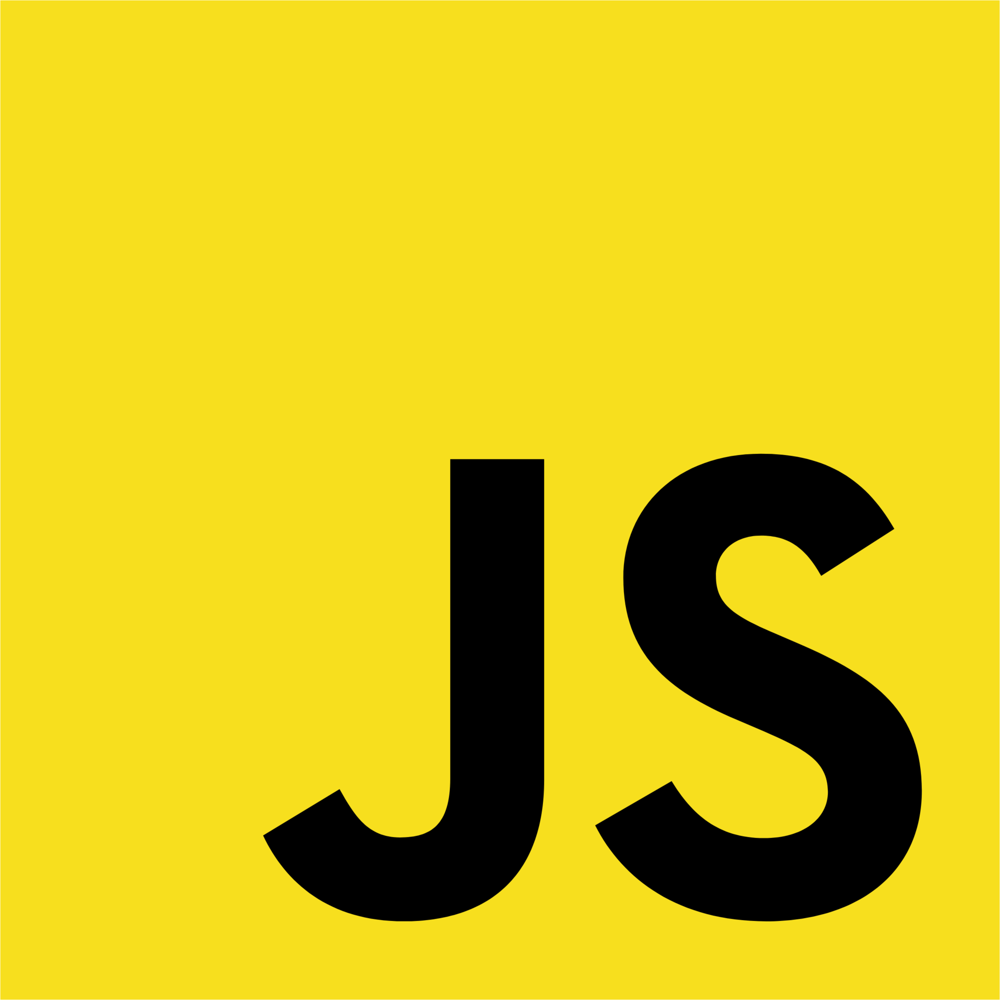
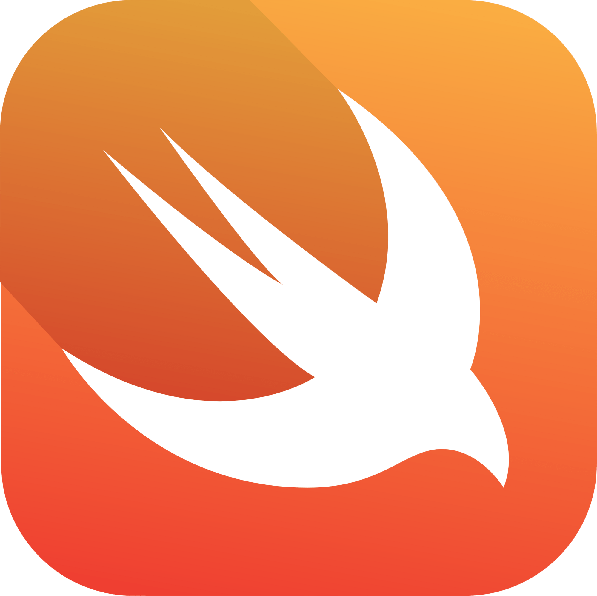
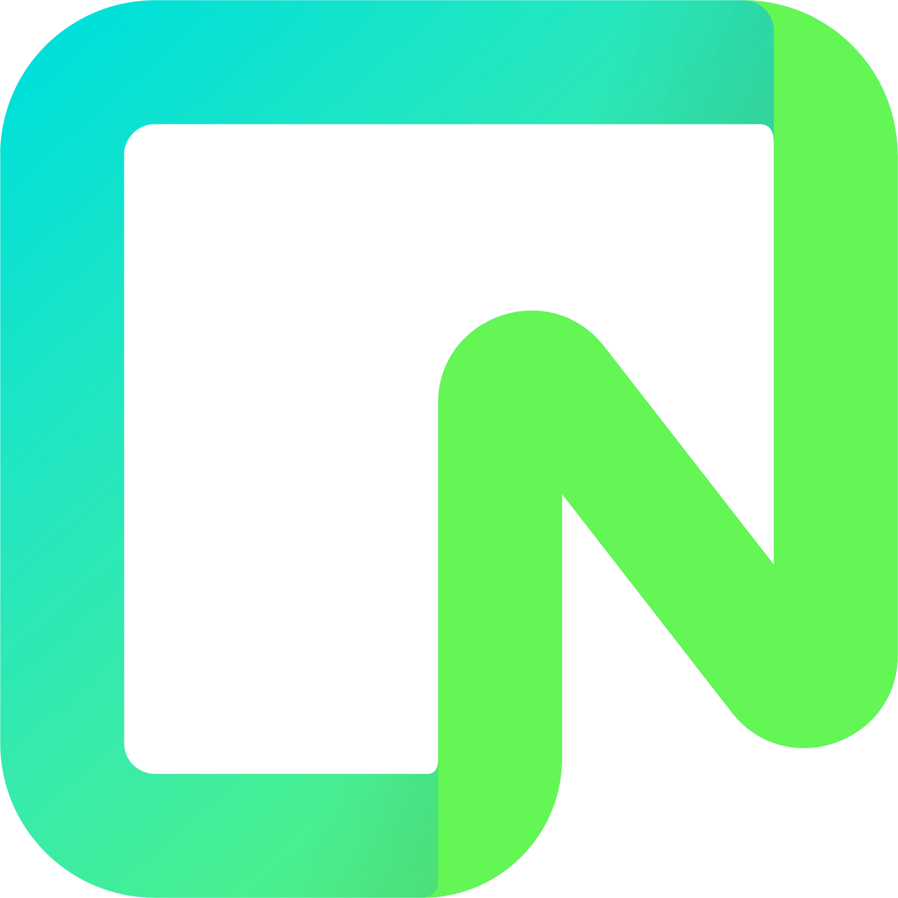
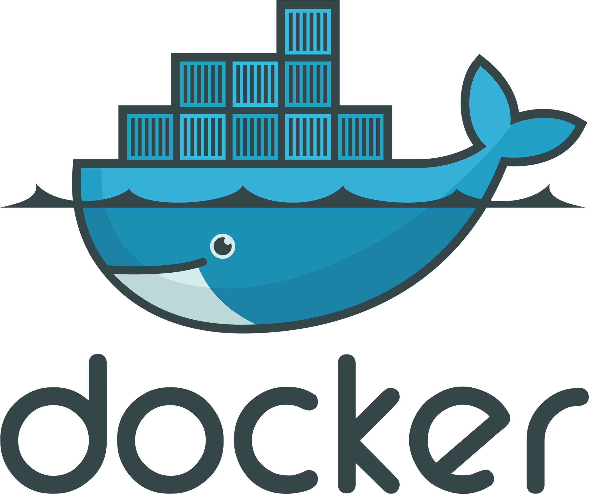
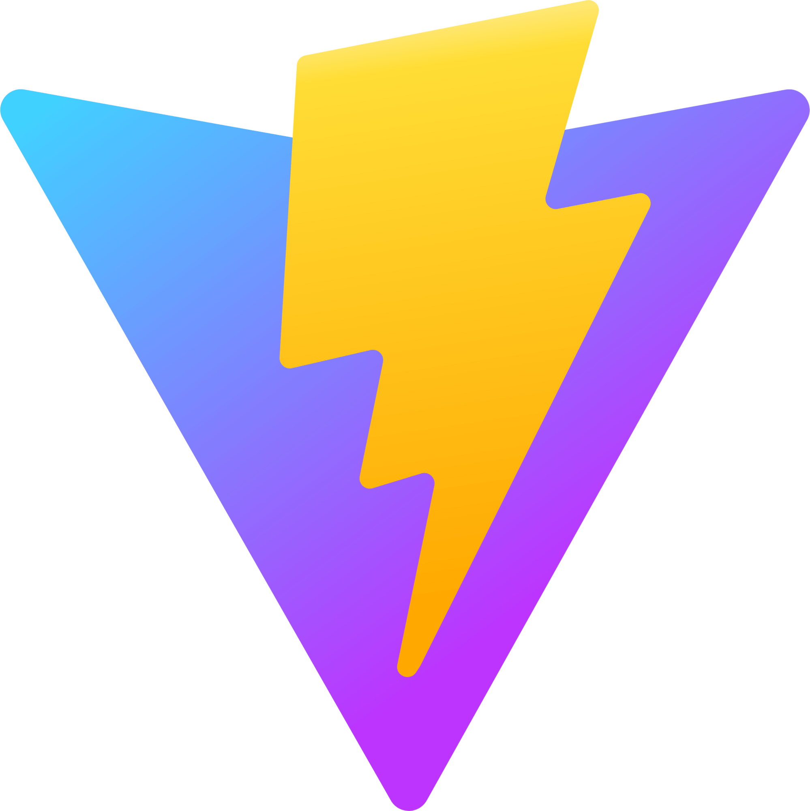

# Hi there, Welcome to MyPage!👋

I'm **Shoya**, a web developer primarily building front-end applications with React.js. I focus on creating responsive, dynamic user interfaces that deliver seamless experiences. Currently, I’m dedicating time to learning and practicing a wide range of technologies and tools, including back-end frameworks like Node.js, Next.js, and Django, as well as exploring topics like web scraping and API integration to build scalable, data-driven solutions!
## Technologies & Tools 🛠️

### Frontend

  
  
  
    
  

### Backend

  
  
  

### Frameworks & Libraries

  
  
  
  
  
  

### Tech Stack & Tools

  
  
  
  
  
  
  
  
  
  
  

## About Me

### 🌍 Currently based in Vancouver, Canada

### 🎓 Recently graduated and actively seeking new opportunities in **web development** and **product design**

### 🎨 Passionate about building scalable back-end systems, leveraging Next.js with Node.js and Django for web scraping, and crafting efficient, data-driven solutions

### 🎬 **Hobbies** include:

- Watching **movies** 🎥
- **Drawing** and exploring new creative techniques ✏️
- **Traveling abroad** to experience different cultures 🌍
- Playing various **musical instruments** 🎸

### 🚀 Aspiring to become a **unique, high-demand web developer** with a strong market value. I thrive on **multitasking** and have a keen interest in everything I do.

## Let's Connect

- [**LinkedIn**](https://www.linkedin.com/in/shoya-horiuchi-83b785278/) - Let's network and collaborate!
- [**Portfolio**](https://meso1007.github.io/JS-Portfolio-Website/) - Check out my latest projects and designs!
- [**Instagram**](https://www.instagram.com/sh02__nmi/?next=%2F) - Follow me for updates and behind-the-scenes content! 📸

Feel free to reach out if you have any questions or just want to chat about **tech** and **design**! 🚀
