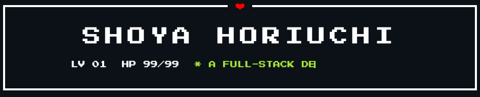

  

<!-- 

  

 -->

  
  
  

  

  

## 01. SYSTEM

I am a Full-Stack Developer striving to become a globally competitive professional. Fully proficient in English and Japanese, I thrive in international environments where communication is as vital as technical execution. I am a lifelong learner, dedicated to evolving my skills to meet global standards.

## 02. ROUTE

- Type-Safe Velocity: Rapid, reliable development with **Go**, **Java**, and **TypeScript**.
- Global Collaboration: Bilingual proficiency (EN/JP) for seamless team alignment.
- Maintainable Design: Building clean, scalable architectures with a focus on DX.
- OSS Ambition: Goal to create open-source tools used by developers worldwide.

## 03. STATS

  
  

  
  

## 04. SKILLS

### [ BACKEND ]

**Core Languages:** Go, Java, Python

### [ FRONTEND ]

**Core Languages:** TypeScript, Next.js, Nuxt.js

### [ INFRASTRUCTURE / ENVIRONMENT ]

**Core Tools:** Docker, AWS, Bun, Linux

## 05. RULES

- Prefer simple and testable designs over unnecessary complexity.
- Optimize for long-term maintainability and team velocity.
- Treat developer experience as part of product quality.

## 06. CONTACT

- Portfolio: [shoyahoriuchi.me](https://www.shoyahoriuchi.me/)
- LinkedIn: [shoya horiuchi](https://www.linkedin.com/in/shoya-horiuchi-83b785278/)
- Gmail: [Send Email](mailto:diegoshoya2017@gmail.com)